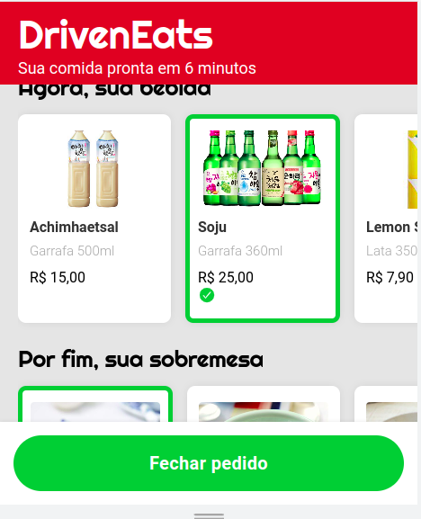
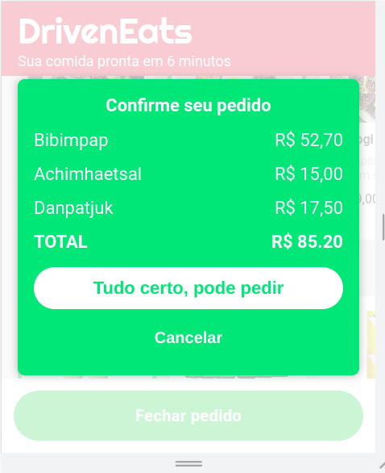

# 💻 projeto3-driveneats

## Sobre
-  Implementação do site (apenas a versão *mobile*) do DrivenEats, um restaurante especial que entrega seu pedido em 6 minutos!
- Para isso, o restaurante só trabalha com um tipo específico de pedido: o combo de Prato + Bebida + Sobremesa.
- O site permite de forma fácil a escolha do seu combo, enviando em seguida o pedido por WhatsApp diretamente para o restaurante.

## 🚀 Tecnologias

Esse projeto foi desenvolvido com as seguintes tecnologias:

- [html](https://html.com/)
- [css](https://www.w3.org/Style/CSS/Overview.en.html)
- [javascript](https://www.javascript.com/)

## 🚀 Resultado

- Aplicar layout para mobile, seguindo o Figma fornecido (não é necessário implementar um layout para desktop).

- Ao clicar sobre um item, ele deve ser marcado como selecionado.
- Ao clicar em um item, caso já exista um item selecionado na mesma categoria, este deve ser 
desmarcado e o novo item clicado deve ser o novo selecionado.
- Quando o usuário tiver selecionado os itens das três categorias, o botão deve mudar para o estado de habilitado.

- Ao finalizar o pedido, o usuário deverá ser encaminhado para o WhatsApp Web, em conversa com o contato do restaurante, já com uma mensagem padrão preenchida.

