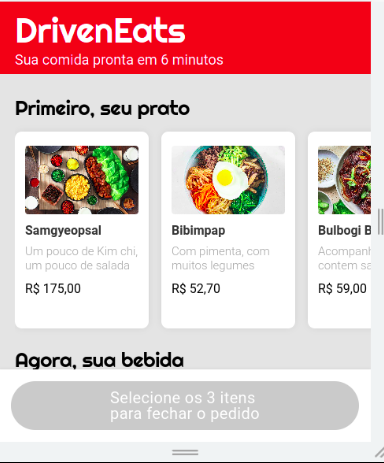

# 💻 projeto3-driveneats

## Sobre
-  Implementação do site (apenas a versão *mobile*) do DrivenEats, um restaurante especial que entrega seu pedido em 6 minutos!
- Para isso, o restaurante só trabalha com um tipo específico de pedido: o combo de Prato + Bebida + Sobremesa.
- O site permite de forma fácil a escolha do seu combo, enviando em seguida o pedido por WhatsApp diretamente para o restaurante.

## 🚀 Tecnologias

Esse projeto foi desenvolvido com as seguintes tecnologias:

- [html](https://html.com/)
- [css](https://www.w3.org/Style/CSS/Overview.en.html)
- [javascript](https://www.javascript.com/)

## 🚀 Resultado

